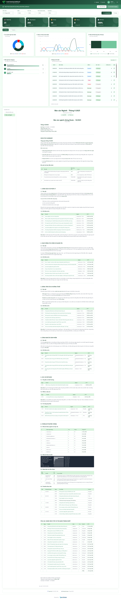

# VCBS Dashboard

Dashboard phân tích Media Monitoring cho VCBS (Vietcombank Securities), xây dựng trên Next.js 14 + Supabase.

## Demo

Truy cập demo tại: **https://vcbs-dashboard.vercel.app**

| Field | Value |
|-------|-------|
| Email | `user@test.com` |
| Password | `test123456@` |



## Tech Stack

| Layer | Technology |
|-------|------------|
| Framework | Next.js 14 (App Router) |
| Language | TypeScript |
| Styling | Tailwind CSS + Radix UI |
| Database | Supabase (PostgreSQL) |
| Charts | Recharts |
| Markdown | ReactMarkdown + Mermaid |
| PDF Export | Puppeteer (server) + Browser Print (fallback) |
| Authentication | Supabase Auth |
| Deployment | Vercel |

## Tính năng chính

### 1. Dashboard Analytics
- **Metric Cards**: Tổng đề cập, tương tác, tích cực/tiêu cực, NSR Score
- **Share of Voice Chart**: Line chart theo dõi xu hướng đề cập/tương tác theo kênh
- **Channel Distribution**: Donut chart phân bổ theo kênh (Báo mạng, Facebook, Youtube, Tiktok)
- **Content Type Chart**: Stacked bar chart phân loại nội dung
- **Category Chart**: Bar chart xếp hạng categories với rank change
- **Articles Table**: Danh sách bài viết chi tiết với pagination

### 2. Cross-Filter (Power BI-like)
- Click vào chart để filter dữ liệu liên quan
- Filter theo: Ngày, Kênh, Category, Loại nội dung
- Tự động cập nhật Articles Table theo filter

### 3. Filter System
- Multi-select filter: Channels, Sentiments, Content Types, Categories, Tiers
- Tier filter luôn hiển thị với options mặc định (A, B, C, D)
- Month/Year picker với "Toàn thời gian" option
- Apply/Reset filters

### 4. Monthly Reports
- Hỗ trợ 3 loại báo cáo:
  - **Nhận định Báo cáo**: Phân tích và nhận định theo tháng/năm
  - **Báo cáo Ngành**: Báo cáo chuyên sâu về ngành theo tháng/năm
  - **Phụ lục**: Chú thích và định nghĩa (không phân theo tháng/năm, hiển thị duy nhất 1 phụ lục)
- Markdown editor với preview (Admin)
- Mermaid diagram support (pie, flowchart, etc.)
- Export PDF với fallback browser print

### 5. Admin Features
- Upload Excel data (parse & import mentions)
- Upload history management
- Report CRUD (Create, Read, Update, Delete)
- Role-based access control (admin/user)

## Cấu trúc thư mục

```
src/
├── app/                          # Next.js App Router
│   ├── (auth)/                   # Auth routes group
│   │   ├── layout.tsx            # Auth layout (no header/footer)
│   │   └── login/page.tsx        # Login page
│   ├── (dashboard)/              # Dashboard routes group
│   │   ├── layout.tsx            # Dashboard layout (header/footer)
│   │   ├── dashboard/page.tsx    # Main dashboard page
│   │   └── admin/                # Admin pages
│   │       ├── upload/page.tsx   # Upload data page
│   │       ├── history/page.tsx  # Upload history page
│   │       └── reports/page.tsx  # Report management page
│   ├── api/                      # API Routes
│   │   ├── data/route.ts         # Dashboard data API
│   │   ├── upload/               # Upload API
│   │   │   ├── route.ts          # Upload handler
│   │   │   ├── [id]/route.ts     # Delete upload
│   │   │   └── history/route.ts  # Upload history
│   │   ├── reports/              # Reports API
│   │   │   ├── route.ts          # List/Create reports
│   │   │   └── [id]/route.ts     # Get/Update/Delete report
│   │   └── export-pdf/           # PDF Export API
│   │       └── [id]/route.ts     # Generate PDF with Puppeteer
│   ├── layout.tsx                # Root layout
│   ├── page.tsx                  # Root redirect to /dashboard
│   └── globals.css               # Global styles
│
├── components/
│   ├── admin/                    # Admin-only components
│   │   ├── AdminBar.tsx          # Admin toolbar (upload button)
│   │   └── MarkdownEditor.tsx    # Markdown editor with preview
│   ├── dashboard/                # Dashboard components
│   │   ├── ArticlesTable.tsx     # Articles data table
│   │   ├── CategoryBarChart.tsx  # Category ranking chart
│   │   ├── ChannelDonutChart.tsx # Channel distribution chart
│   │   ├── ChartCard.tsx         # Chart wrapper component
│   │   ├── ContentTypeStackChart.tsx
│   │   ├── DashboardFooter.tsx
│   │   ├── DashboardHeader.tsx
│   │   ├── FilterBar.tsx         # Filter controls
│   │   ├── MetricCard.tsx        # KPI metric card
│   │   ├── MonthlyReportSection.tsx # Report display/list
│   │   ├── MonthPicker.tsx       # Month/Year selector
│   │   ├── MultiSelectFilter.tsx # Multi-select dropdown
│   │   ├── ReportTypeSidebar.tsx # Report type tabs
│   │   └── SOVLineChart.tsx      # Share of Voice line chart
│   ├── shared/                   # Shared components
│   │   ├── ChannelBadge.tsx      # Channel indicator badge
│   │   ├── LoadingSpinner.tsx    # Loading indicator
│   │   ├── MermaidBlock.tsx      # Mermaid diagram renderer
│   │   ├── RankChange.tsx        # Rank change indicator
│   │   └── SentimentBadge.tsx    # Sentiment indicator
│   └── ui/                       # UI primitives (shadcn/ui)
│       ├── button.tsx
│       ├── card.tsx
│       ├── input.tsx
│       ├── label.tsx
│       ├── select.tsx
│       ├── table.tsx
│       └── badge.tsx
│
├── hooks/                        # Custom React hooks
│   ├── useAuth.ts                # Auth state & role checking
│   ├── useDashboardData.ts       # Dashboard data fetching
│   ├── useExportPDF.ts           # PDF export logic
│   ├── useFilters.ts             # Filter state management
│   └── useMonthlyReports.ts      # Report data fetching
│
├── lib/
│   ├── constants.ts              # App constants
│   ├── utils.ts                  # Utility functions (cn, etc.)
│   ├── supabase/                 # Supabase clients
│   │   ├── client.ts             # Browser client
│   │   ├── server.ts             # Server client
│   │   └── middleware.ts         # Auth middleware helpers
│   └── utils/
│       └── excel-parser.ts       # Excel file parser
│
├── styles/
│   └── theme.ts                  # Theme colors (forest palette)
│
├── types/
│   └── index.ts                  # TypeScript type definitions
│
└── middleware.ts                 # Next.js middleware (auth protection)
```

## Database Schema (Supabase)

### Tables

| Table | Description |
|-------|-------------|
| `profiles` | User profiles với role (admin/user) |
| `mentions` | Media mentions data |
| `brands` | Brand configuration |
| `upload_history` | Upload batch tracking |
| `category_rankings` | Category rank history |
| `monthly_reports` | Monthly analysis reports |

### Key Types

```typescript
// Report types
type ReportType = 'nhan_dinh' | 'bao_cao_nganh' | 'phu_luc';

// Channel types
type Channel = 'Báo mạng' | 'Facebook' | 'Youtube' | 'Tiktok';

// Sentiment types
type Sentiment = 'Tích cực' | 'Tiêu cực' | 'Trung tính';

// Content types
type ContentType =
  | 'Tin tức thị trường'
  | 'Bán hàng/Môi giới'
  | 'Tin trực tiếp về thương hiệu';

// Category types (15 categories)
type Category = 'Cổ phiếu' | 'Trái phiếu' | 'Chứng chỉ quỹ' | ... | 'Khác'
```

## Environment Variables

```env
NEXT_PUBLIC_SUPABASE_URL=https://xxx.supabase.co
NEXT_PUBLIC_SUPABASE_ANON_KEY=eyJxxx...
```

## Cài đặt & Chạy

```bash
# Install dependencies
npm install

# Run development server
npm run dev

# Build for production
npm run build

# Start production server
npm start
```

## API Endpoints

| Method | Endpoint | Description |
|--------|----------|-------------|
| GET | `/api/data` | Dashboard data với filters |
| POST | `/api/upload` | Upload Excel file |
| GET | `/api/upload/history` | Upload history list |
| DELETE | `/api/upload/[id]` | Delete upload batch |
| GET | `/api/reports` | List reports |
| POST | `/api/reports` | Create report |
| GET | `/api/reports/[id]` | Get report detail |
| PUT | `/api/reports/[id]` | Update report |
| DELETE | `/api/reports/[id]` | Delete report |
| GET | `/api/export-pdf/[id]` | Export report to PDF |

## PDF Export

Hệ thống export PDF có 2 mode:

1. **Server-side (Puppeteer)**: Render HTML -> PDF với `@sparticuz/chromium`
   - Ưu điểm: Text selectable, links clickable
   - Hạn chế: Cần Chromium binary, không hoạt động trên Vercel serverless

2. **Browser Print (Fallback)**: Mở popup với styled HTML -> Print dialog
   - Tự động fallback khi server PDF fail
   - Hoạt động trên mọi environment

## Deployment

### Vercel

```bash
# Deploy via Vercel CLI
vercel deploy

# Or connect GitHub repo to Vercel
```

### Self-hosted (với Puppeteer)

Để enable server-side PDF:

1. Sử dụng `@sparticuz/chromium-min`
2. Host Chromium binary trên S3/CDN
3. Update `chromium.executablePath(url)`

## License

Private - VCBS Internal Use Only